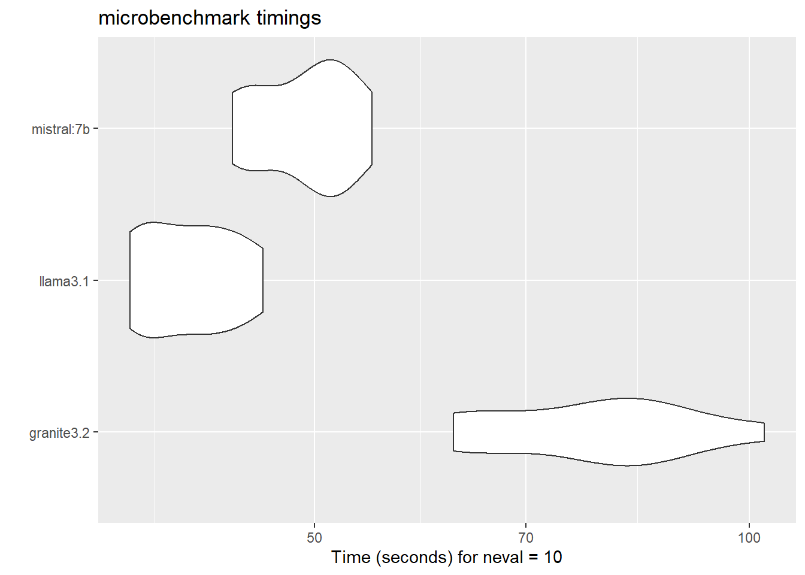
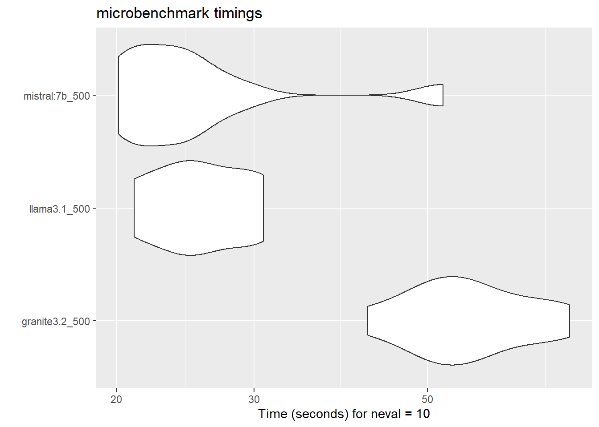
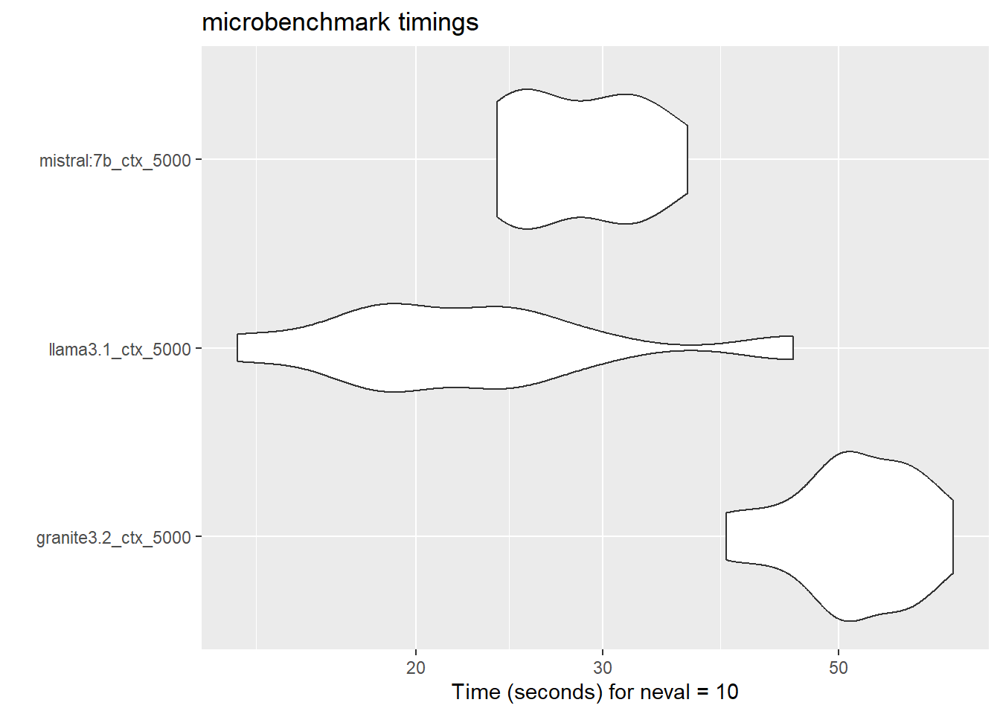

# The Challenge: AI Summarization Behind Closed Doors

With the explosion of open-source Large Language Models (LLMs), the barrier to entry for building automated summarization tools has plummeted. In translational sciences, where researchers are constantly inundated with new literature, a tool that can quickly summarize a paper or answer questions about its contents is incredibly valuable.

However, at my previous organization, we faced a hard constraint common in the biotech and pharmaceutical industries: *strict data privacy.*

We needed a tool to process internal reports and external literature, but we could not share any information outside of the company's network. This immediately ruled out API-driven solutions like OpenAI, Anthropic, or any implementation requiring external connections. The objective was clear: keep it simple, keep it local, and build an interface that researchers could easily use.

## Exploring the Ecosystem

When deciding how to tackle this, there were two distinct pathways:

1. Train an LLM entirely from scratch (computationally expensive and largely impractical for a prototype).
2. Implement and potentially fine-tune a local version of an existing open-source LLM.

I opted for the second route. Since my primary stack for this project was R, I spent time exploring the rapidly growing landscape of R-based LLM packages.

While packages like ellmer and tidychatmodels provide fantastic tidyverse-aligned syntax, they largely rely on web APIs. I found heavier inspiration in Stephen Turner’s work on biorecap, which targets bioRxiv preprints using local models.

Ultimately, the winning combination was pairing R and Shiny with Ollama. Ollama allows for seamless local LLM hosting, and the R package rollama provided the perfect bridge to call these local instances directly from my R environment without data ever leaving the machine.

## Building the Application

The prototype took the form of an R Shiny application. The workflow was designed to be as frictionless as possible: a user uploads a scientific PDF, the app parses the text, and feeds it to the local LLM via Ollama.

Here is a look at the core server logic handling the summarization and timing the response:
```R

library(shiny)
library(pdftools)
library(rollama)

# Core summarization function
sum.timer.fun <- function(x){
  pdf <- input$pdfInput
  req(pdf)
  start.time <- Sys.time()
  
  # Calling the local model via rollama
  sum <- query(x, 
               output = "text",
               model = "granite3.2",
               model_params = list(num_gpu = 0,
                                   num_ctx = ctx()) # Dynamic context window
  )
  end.time <- Sys.time()
  time.taken <- end.time - start.time
  
  return(
    list(
      sum = sum,
      time.taken = time.taken
    )
  )
}
```
To make the tool more dynamic, I also implemented basic Retrieval-Augmented Generation (RAG) methods. Users could query the document directly—for example, asking about the presence of a specific biomarker—and receive a context-aware answer from the uploaded text.

## Benchmarking the "Memory Wall"

To keep costs minimal and determine the viability of this approach, I benchmarked several open-source models using the microbenchmark package. I tested models like IBM's granite3.2, Meta's llama3.1, and mistral:7b on varying text lengths (from 500 characters up to full papers).

Here is an example of the benchmarking setup for a full paper analysis:
```R

library(tidyverse)
library(microbenchmark)

# Extracting text from a sample paper
txt <- pdf_text("RRP_paper.pdf")
txt_bind <- str_flatten(txt)

# Constructing the query
q_zs <- make_query(
  text = txt_bind,
  prompt = "Summarize the paper in 5 simple sentences or less.",
  system = "You summarize scientific papers in lay terms."
)

# Benchmarking the models
mbm_models_defaults <- microbenchmark(
  "granite3.2" = { query(q_zs, output = "text", model = "granite3.2", model_params= list()) },
  "llama3.1"   = { query(q_zs, output = "text", model = "llama3.1", model_params= list()) },
  "mistral:7b" = { query(q_zs, output = "text", model = "mistral:7b", model_params= list()) },
  times = 10
)

autoplot(mbm_models_defaults)
```

(Below: Violin plots showing the distribution of inference times across the tested models)



When running smaller chunks of text (like 500 characters), the models performed reliably well.



## The Hardware Bottleneck

This is where the physical limitations of current hardware became the primary bottleneck. Time-to-completion wasn't just a factor of character count; it was heavily dependent on the chosen context window (num_ctx).

During benchmarking, I ran into a fascinating infrastructure quirk:
- I was able to run "full" benchmarking successfully on my local laptop.
- However, when deploying to the server, anything larger than a "half-paper" crashed the process due to Out-Of-Memory (OOM) errors.

```R

# Increasing the context window drastically impacted memory usage
q_ctx_5000 <- make_query(
  text = txt_bind,
  prompt = "Summarize the paper in 5 simple sentences or less.",
  system = "You summarize scientific papers in lay terms."
)

mbm_models_ctx_5000 <- microbenchmark(
  "granite3.2_ctx_5000" = { query(q_ctx_5000, output = "text", model = "granite3.2", model_params= list(num_ctx = 5000)) },
  "llama3.1_ctx_5000"   = { query(q_ctx_5000, output = "text", model = "llama3.1", model_params= list(num_ctx = 5000)) },
  times = 10
)
```


The server objectively had enough raw RAM, but local LLMs are highly dependent on VRAM and cache management during active generation. The context window requirements for processing full scientific papers simply overwhelmed the server's available resources for caching the attention mechanisms.

## Takeaways

Building this prototype proved that creating private, locally hosted AI tools for translational science is entirely feasible using R, Shiny, and open-source models. The privacy guarantees are absolute, and the R ecosystem is maturing rapidly to support these workflows.

However, the hardware limitations are real. Open-source LLMs are incredibly capable, but processing large, dense scientific PDFs locally requires careful management of context windows and a solid understanding of the host machine's memory architecture.

As open-source models become more efficient and quantization techniques improve, this kind of local, secure architecture will likely become a standard tool in the data scientist's kit.