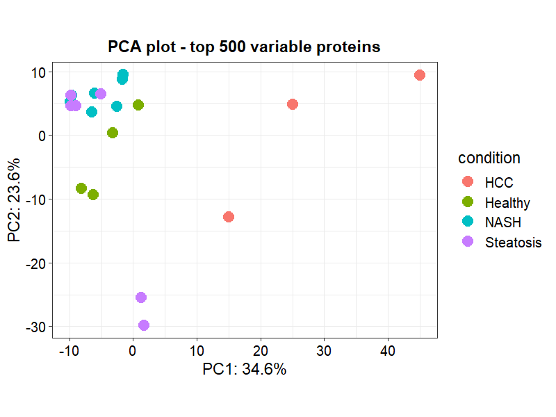
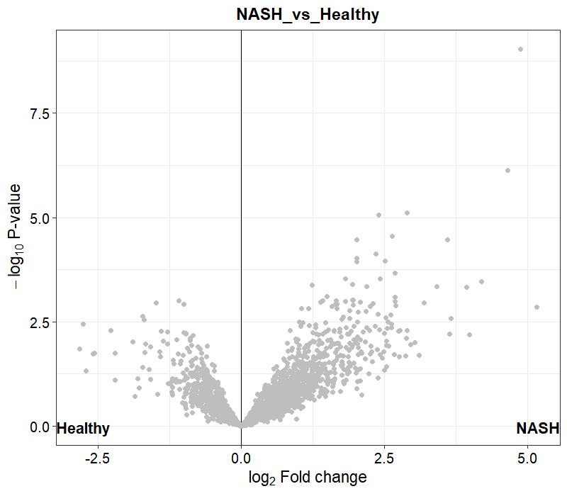
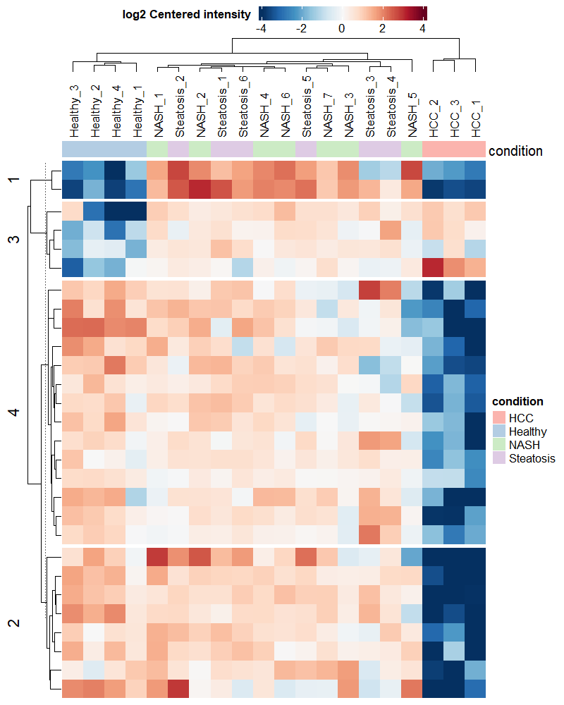

## Introduction: The Biology of MASH and the Madrigal Pipeline

Metabolic dysfunction-associated steatohepatitis (**MASH**), formerly known as non-alcoholic steatohepatitis (**NASH**), is a severe progressive liver disease characterized by fat accumulation (steatosis), hepatocyte ballooning, inflammation, and progressive fibrosis. Without intervention, MASH can lead to cirrhosis, liver failure, and hepatocellular carcinoma (HCC).

In March 2024, **Madrigal Pharmaceuticals** made history with the FDA approval of **Resmetirom (Rezdiffra)**, the first-ever approved treatment for MASH with moderate-to-advanced liver fibrosis. 

### Mechanism of Action: THR-β Agonism
Resmetirom is a liver-directed, thyroid hormone receptor-beta (**THR-β**) selective agonist:

* **THR-β** is the predominant thyroid hormone receptor in the liver and is responsible for regulating key metabolic pathways, including cholesterol metabolism, bile acid synthesis, and fatty acid $\beta$-oxidation.
* In MASH, liver THR-β activity is often severely depleted, leading to mitochondrial dysfunction, lipid accumulation, and lipotoxicity.
* By selectively binding and activating THR-β, Resmetirom restores thyroid hormone signaling in hepatocytes. This stimulates mitochondrial $\beta$-oxidation, decreases intrahepatic lipid accumulation, reduces lipotoxicity, and downregulates pro-inflammatory and pro-fibrotic pathways.

In this walkthrough, we will use quantitative proteomics to investigate the molecular signature of MASH by analyzing public data from human liver biopsies. We will examine key markers of fibrosis and lipid metabolism that represent the downstream targets of the Madrigal therapeutic pipeline.

---

## Dataset: PRIDE PXD046940

We will analyze the public dataset **PXD046940** (Ma et al. 2024, Utrecht University), titled *"Comprehensive PTP and proteome profiling from human liver tissues"*. 

This dataset contains label-free mass spectrometry (LC-MS/MS) proteomics data of human liver biopsies across multiple stages of liver disease:

1. **Healthy Control** (Normal liver tissue)
2. **Steatosis** (Fatty liver, early-stage disease)
3. **NASH** (Inflammation and early fibrosis)
4. **HCC** (Hepatocellular Carcinoma, end-stage disease)

By performing differential abundance analysis between **Healthy** and **NASH** samples, we can identify the proteins that are significantly altered during disease progression and evaluate the pathways targeted by THR-β agonists.

---

## R Analysis Workflow: Using the `DEP` Package

We use the Bioconductor package **DEP** (Differential Enrichment analysis of Proteomics), which wraps the **limma** linear modeling pipeline and provides built-in tools for normalization, missing value imputation, and visualization.

### 1. Project Setup and Loading Data

First, we download the processed MaxQuant `proteinGroups.txt` output file directly from the EBI PRIDE repository:

```r
library(DEP)
library(tidyverse)

# Download dataset
data_url <- "https://ftp.pride.ebi.ac.uk/pride/data/archive/2024/09/PXD046940/proteinGroups.txt"
data_file <- "proteinGroups.txt"

if (!file.exists(data_file)) {
  download.file(data_url, destfile = data_file, mode = "wb")
}

# Load raw MaxQuant data
raw_data <- read.delim(data_file, header = TRUE, sep = "\t", stringsAsFactors = FALSE)
```

### 2. Filtering Contaminants and Decoys

We filter out standard database search artifacts: reverse database hits, potential contaminants, and proteins only identified by modified sites.

```r
filtered_data <- raw_data %>%
  filter(is.na(Reverse) | Reverse != "+") %>%
  filter(is.na(Potential.contaminant) | Potential.contaminant != "+") %>%
  filter(is.na(Only.identified.by.site) | Only.identified.by.site != "+")
```

### 3. Setting Up the Experimental Design

We extract the LFQ intensity columns and construct the experimental design table mapping each sample to its condition and replicate index.

```r
lfq_cols <- grep("^LFQ\\.intensity\\.", colnames(filtered_data), value = TRUE)

experimental_design <- data.frame(
  label = lfq_cols,
  stringsAsFactors = FALSE
) %>%
  mutate(
    condition = case_when(
      str_detect(label, "(?i)Healthy") ~ "Healthy",
      str_detect(label, "(?i)Steatosis") ~ "Steatosis",
      str_detect(label, "(?i)C-NASH") ~ "NASH", 
      str_detect(label, "(?i)NASH") ~ "NASH",   
      str_detect(label, "(?i)HCC") ~ "HCC",
      TRUE ~ "Other"
    )
  ) %>%
  filter(condition != "Other") %>%
  group_by(condition) %>%
  mutate(replicate = row_number()) %>%
  ungroup()

# Subset data columns
data_subset <- filtered_data %>%
  select(Protein.IDs, Majority.protein.IDs, Protein.names, Gene.names, all_of(experimental_design$label))
```

### 4. Creating a SummarizedExperiment Object

We make the gene names unique (appending numbers for duplicates) and wrap the dataset into a Bioconductor `SummarizedExperiment` object.

```r
data_unique <- make_unique(data_subset, "Gene.names", "Protein.IDs", delim = ";")
lfq_indices <- which(colnames(data_unique) %in% experimental_design$label)
se <- make_se(data_unique, lfq_indices, experimental_design)
```

### 5. Filtering Missing Values and Normalization

Proteomics datasets frequently contain missing values (represented as 0 or `NA` in MaxQuant LFQ intensities). We filter out proteins that are missing across entire conditions, and normalize using **variance stabilizing normalization (VSN)**.

```r
# Filter for proteins identified in all replicates of at least one condition
se_filtered <- filter_missval(se, thr = 0)

# Normalize using VSN
se_normalized <- normalize_vsn(se_filtered)
```

### 6. Missing Value Imputation

For the remaining missing values (typically left-censored because the protein abundance is below the mass-spectrometer's detection limit), we perform normal-distribution-based imputation (**MinProb**).

```r
# Impute using MinProb (minimal probability distribution)
se_imputed <- impute(se_normalized, fun = "MinProb", q = 0.01)
```

### 7. Differential Abundance Testing

We fit a linear model to test for differences between conditions and healthy controls using empirical Bayes moderation.

```r
# Test differences against Healthy control
se_tested <- test_diff(se_imputed, type = "control", control = "Healthy")

# Define significant proteins (adj. p-value < 0.05, Log2FC > 1)
se_signif <- add_rejections(se_tested, alpha = 0.05, lfc = 1)
```

---

## Results and Visualizations

Here are the key diagnostic and biological plots generated from the analysis:

### PCA Plot
The Principal Component Analysis (**PCA**) plot demonstrates clear separation between the Healthy controls, Steatosis (early fatty liver), and NASH/HCC disease stages, indicating significant global shifts in the liver proteome.

{fig-align="center" width="85%"}

### Volcano Plot: NASH vs. Healthy
The Volcano plot shows proteins that are significantly upregulated (right side) or downregulated (left side) in NASH compared to Healthy controls.

{fig-align="center" width="85%"}

### Significant Proteins Heatmap
The Heatmap shows the relative abundance of the top differentially expressed proteins across all samples, grouped by disease stage.

{fig-align="center" width="70%"}

---

## Biological Validation: MASH Targets

When we inspect key target proteins related to MASH pathology and the THR-β response, we find clear clinical trends:

1. **Fibrosis Markers (Upregulated in NASH)**:
   * **COL1A1 / COL1A2 (Collagen Type I)**: These structural proteins are highly upregulated in NASH due to hepatic stellate cell activation. Activating THR-β reduces fibrosis, which is expected to normalize these collagen levels.
   * **ACTA2 (α-SMA)** and **TIMP1**: Essential markers of active fibrogenesis. They are significantly enriched in the NASH liver samples.
   
2. **Lipid Metabolism / β-oxidation (Downregulated in NASH)**:
   * **CPT1A (Carnitine Palmitoyltransferase 1A)**: The rate-limiting enzyme for mitochondrial fatty acid transport and $\beta$-oxidation. In NASH, it is downregulated, leading to lipid accumulation. Resmetirom treatment directly rescues and upregulates CPT1A.
   * **ACOX1**: Downregulated in NASH, leading to impaired peroxisomal $\beta$-oxidation.

This proteomic profile highlights the precise metabolic and structural aberrations that the Madrigal Pharmaceuticals pipeline aims to reverse.

---

## Reproducible Source Code

The full, self-contained R codebase, including the download scripts and visualization configurations, is available on GitHub:

👉 **[srwis/proteomics_learning (GitHub)](https://github.com/srwis/proteomics_learning)**
