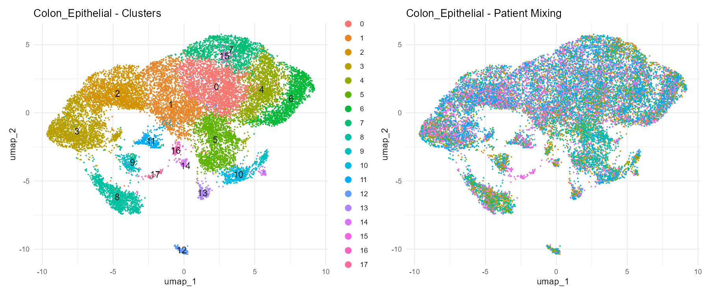
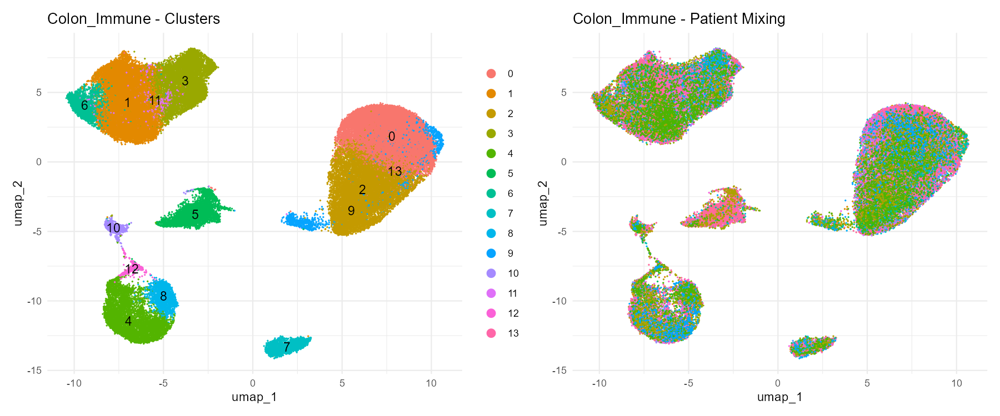
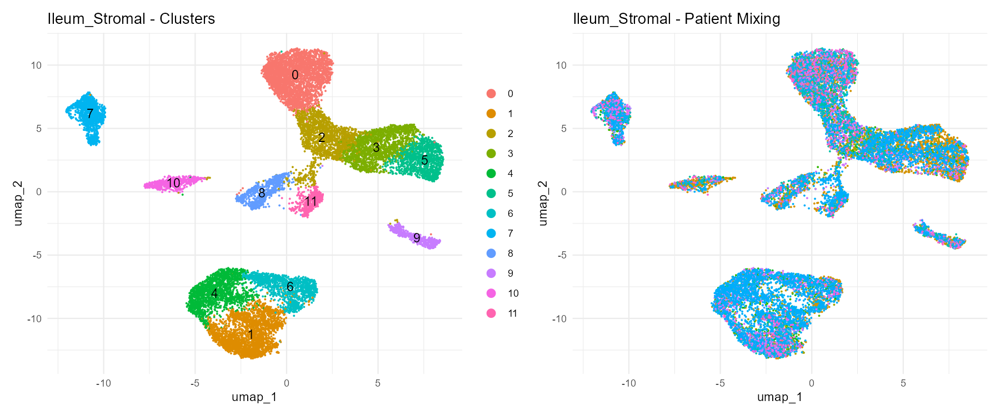
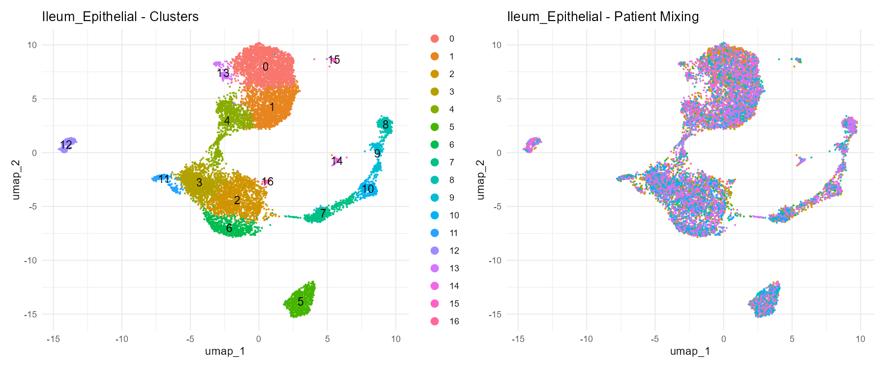
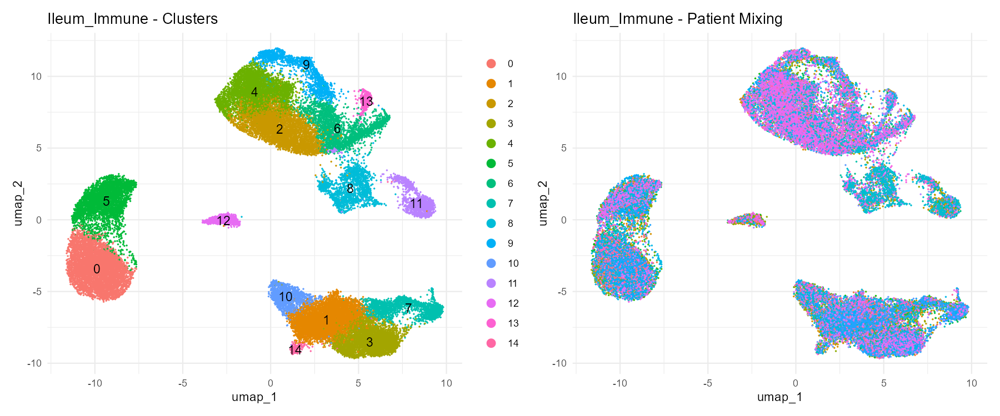

## Introduction: The Biology of Tissue Compartments in Crohn's Disease

In **Part 1**, we established a quality control and batch integration pipeline on a pilot dataset of the **Colon Stromal** (`CO_STR`) compartment. While stromal cells (like fibroblasts and pericytes) play crucial structural roles and contribute to chronic tissue remodeling, Crohn's Disease is fundamentally a disease of mucosal barrier disruption and immune infiltration.

To build a complete map of the tissue microenvironment in Crohn's Disease, we need to analyze the other compartments in the dataset. In this post, we expand our pipeline to the 5 remaining compartments:

1. **Colon Epithelial** (`CO_EPI`): The mucosal barrier itself. Enterocytes, goblet cells, and stem cells that directly interface with the gut microbiome and are the first line of defense.
2. **Colon Immune** (`CO_IMM`): The infiltrating and resident immune populations (macrophages, T-cells, B-cells, dendritic cells) that drive inflammatory lesions in active Crohn's disease.
3. **Ileum Stromal** (`TI_STR`): The structural compartment of the terminal ileum, allowing comparison of stromal remodeling between the colon and ileum.
4. **Ileum Epithelial** (`TI_EPI`): The epithelial barrier of the terminal ileum, representing the small intestinal response to disease.
5. **Ileum Immune** (`TI_IMM`): The immune cells residing in the terminal ileum, helping compare regional immune signatures.

By analyzing each compartment separately, we can identify compartment-specific cell types and clusters, control for technical batch effects across patients using **Harmony**, and prepare the datasets for downstream clinical metadata mapping and differential expression testing.

---

## Memory-Efficient Pipeline in R

Some of these raw matrices are very large (up to 2.8 GB for `TI_EPI`), containing tens of thousands of cells. Reading and processing all 5 datasets simultaneously can easily exceed system RAM and lead to crashes. 

To address this, we developed a sequential loop-based script `Part2_analysis.R` that:
- Processes one compartment at a time.
- Applies standard default QC parameters customized per compartment.
- Performs normalization, scaling, PCA, Harmony integration, SNN clustering, and UMAP.
- Saves the clean, integrated Seurat object (`.rds`) and diagnostic plots (`.png`) to disk.
- Cleans up memory using `rm()` and triggers garbage collection (`gc()`) after each compartment.

Here is the code used to run the pipeline:

```r
library(Seurat)
library(dplyr)
library(ggplot2)
library(harmony)
library(purrr)
library(patchwork)

# Configuration of compartments and paths
expression_dir <- "data/SCP1884/expression"
compartments <- list(
  "CO_EPI" = list(path = file.path(expression_dir, "62a79393d8bced7ddefbf0d1"), name = "Colon_Epithelial"),
  "CO_IMM" = list(path = file.path(expression_dir, "62a7a911a54b79c09baa336a"), name = "Colon_Immune"),
  "TI_STR" = list(path = file.path(expression_dir, "62a7b26f0e85c7e6d0bb03f0"), name = "Ileum_Stromal"),
  "TI_EPI" = list(path = file.path(expression_dir, "62a7b6bf52be218275f15f43"), name = "Ileum_Epithelial"),
  "TI_IMM" = list(path = file.path(expression_dir, "62a7c0fd3c8dbbf858d3ac47"), name = "Ileum_Immune")
)

# Robust baseline QC thresholds per compartment
compartment_qc <- list(
  "CO_EPI" = list(min_feat = 200, max_feat = 4000, max_count = 15000, max_mt = 5),
  "CO_IMM" = list(min_feat = 200, max_feat = 2500, max_count = 10000, max_mt = 5),
  "TI_STR" = list(min_feat = 200, max_feat = 3000, max_count = 12000, max_mt = 5),
  "TI_EPI" = list(min_feat = 200, max_feat = 4000, max_count = 15000, max_mt = 5),
  "TI_IMM" = list(min_feat = 200, max_feat = 2500, max_count = 10000, max_mt = 5)
)

for (comp_id in names(compartments)) {
  comp_info <- compartments[[comp_id]]
  comp_path <- comp_info$path
  comp_name <- comp_info$name
  
  # 1. Load Raw Data
  se_raw <- create_seurat_obj(comp_path, comp_name)
  
  # 2. Quality Control by Patient
  patient_list <- SplitObject(se_raw, split.by = "orig.ident")
  filtered_list <- imap(patient_list, function(obj, patient_id) {
    thresh <- compartment_qc[[comp_id]]
    obj[["percent.mt"]] <- PercentageFeatureSet(obj, pattern = "^MT-")
    
    keep_cells <- colnames(obj)[
      obj$nFeature_RNA > thresh$min_feat & 
      obj$nFeature_RNA < thresh$max_feat & 
      obj$nCount_RNA < thresh$max_count &
      obj$percent.mt < thresh$max_mt
    ]
    if (length(keep_cells) == 0) return(NULL)
    
    return(subset(obj, cells = keep_cells))
  })
  filtered_list <- compact(filtered_list)
  
  # Merge back
  se_clean <- merge(filtered_list[[1]], filtered_list[-1])
  
  # 3. Processing
  se_clean <- NormalizeData(se_clean)
  se_clean <- FindVariableFeatures(se_clean)
  se_clean <- ScaleData(se_clean)
  se_clean <- RunPCA(se_clean)
  
  # 4. Harmony Integration
  se_clean <- IntegrateLayers(
    object = se_clean,
    method = HarmonyIntegration,
    orig.reduction = "pca",
    new.reduction = "harmony"
  )
  
  # 5. Clustering and UMAP
  se_clean <- FindNeighbors(se_clean, reduction = "harmony", dims = 1:20)
  se_clean <- FindClusters(se_clean, resolution = 0.5)
  se_clean <- RunUMAP(se_clean, reduction = "harmony", dims = 1:20)
  
  # Save RDS object
  saveRDS(se_clean, file.path("data", paste0("integrated_", tolower(comp_id), ".rds")))
  
  # Free memory
  rm(se_raw, patient_list, filtered_list, se_clean)
  gc()
}
```

---

## Batch Integration Results: UMAP Plots

For each compartment, we verified that Harmony successfully integrated equivalent cell types across the 38 patient biopsies, resulting in overlapping patient distributions within biologically distinct clusters.

Here are the side-by-side UMAP embeddings showing clusters and patient mixing:

### 1. Colon Epithelial (`CO_EPI`)
Epithelial cells cluster tightly by lineage (stem cells, enterocytes, goblet cells). Harmony integration prevents patient-specific technical batches from separating these lineages.

{fig-align="center" width="95%"}

### 2. Colon Immune (`CO_IMM`)
The immune compartment shows standard lymphocytic (T-cell, B-cell, NK-cell) and myeloid clusters. Patient biopsies are well-mixed, indicating robust technical batch correction.

{fig-align="center" width="95%"}

### 3. Ileum Stromal (`TI_STR`)
Similar to the colon stromal compartment, fibroblasts and endothelial cell populations form clear biological structures with no patient-specific separation.

{fig-align="center" width="95%"}

### 4. Ileum Epithelial (`TI_EPI`)
Small intestinal epithelial lineages (including enterocytes with strong digestive gene signatures and secretory Paneth cells) form distinct clusters.

{fig-align="center" width="95%"}

### 5. Ileum Immune (`TI_IMM`)
The ileal immune microenvironment represents a critical mucosal immunology hub. Harmony successfully aligned patient cells to reveal shared immune states.

{fig-align="center" width="95%"}

---

## Conclusion and Next Steps

With all 6 compartments (Colon Stromal, Colon Epithelial, Colon Immune, Ileum Stromal, Ileum Epithelial, and Ileum Immune) now quality-filtered and batch-integrated, we have a robust multi-compartment single-cell atlas.

In **Part 3**, we will proceed to:
- Map global metadata containing disease state (healthy vs. active inflamed vs. non-inflamed lesions).
- Perform marker gene identification to annotate these clusters with high-resolution cell type labels.
- Run differential expression analysis to identify the pathways altered in inflamed Crohn's disease tissue compared to non-inflamed and healthy controls.
